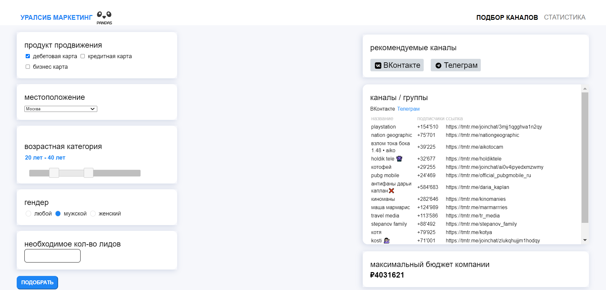

# Moscow City Hack 2022
# Команда Pandas

## Установка

1. Введите в командной строке `git clone https://github.com/SXHRYU/MoscowCityHack2022`;
2. Зайдите в папку, которую только что скачали (`cd MoscowCityHack2022`);
3. Перейдите в нужную ветку репозитория командой `git checkout master`;
4. Установите [Python](https://www.python.org/downloads/);
5. Установите все зависимости: зайдите в корневую папку, где располагаются все файлы проекта (по умолчанию, _MoscowCityHack2022_). В командной строке введите `pip install -r requirements.txt`;
6. Убедитесь, что все зависимости из файла _requirements.txt_ скачались командой `pip list`. Если какие-то зависимости **по какой-либо причине** не скачались, установите их вручную командой `pip install %название_модуля%`;
7. Убедившись, что все зависимости скачаны, перейдите в корневую папку (если вы не в ней) и введите в командной строке `python manage.py runserver`;
8. В командной строке должно отображаться `Starting development server at http://127.0.0.1:8000/` (если вы поменяли порт при запуске, то у вас отобразится другое значение порта).
9. Откройте любой браузер (приложение проверено работает на Google Chrome) и введите в поисковой строке http://127.0.0.1:8000/.

## Содержание репозитория

### Папки
* Папка "Условие": содержит условие задачи, шаблон презентации, аналитические исследования и т. д.;
* Папка "hackathon": содержит автоматически-сгенерированные файлы Django;
* Папка "recommendations":
    * "logic": содержит файл `__init__.py`, чтобы Python воспринимал эту папку как модуль, `parser_urls.py` и `tg_parser.py` содержат ссылки на внешний сервис **telemetr**, с которого парсятся данные о популярных телеграм-каналах, и сам парсер, который разделяет каналы по характеристическим группам (указаны в файле), соответственно. Также там расположены `person_info.py` и `tg_recommendation.py`, в котором находятся интерфейсы и объекты для *type hinting*;
    * "static" и "templates" содержат статические файлы (изображения, JavaScript и CSS) и HTML-файл соответственно;
    * `urls.py` содержит ссылки для работы в Django-приложении;
    * `cities.py` содержит список городов России для соответствующего поля формы на сайте;
    * `views.py`: главный файл, объединяющий различные компоненты программы, производящий основные вычисления и выдающий HTML-файл со всеми посчитанными данными пользователю.

### Ветки
* Ветка **parser** содержит программу для парсинга данных с сервиса **telemetr**;
* Ветка **data_science** содержит файл **Jupyter Notebook**, в котором содержатся различные расчёты и модели, используемые для составления решения и расчётов;
* Ветка **django** содержит серверную часть приложения, которое отвечает за подсчёты на стороне сервера и выдачу получившихся результатов пользователю в HTML-документе;
* Ветка **main** содержит конечные версии всех компонентов приложения, **README**, файл **Jupyter Notebook** и список зависимостей **requirements.txt**.

## Взаимодействие с приложением

В левой части экрана расположена форма для выбора параметров рекламной кампании.
Выберите продукт, расположение клиентов, диапазон возрастов, пол, количество лидов и нажмите кнопку "ПОДОБРАТЬ".
Справа должны отобразиться телеграм-каналы, в которых рекомендуется покупать рекламу, с некоторыми характеристиками и максимальный бюджет, который можно выделить. 
